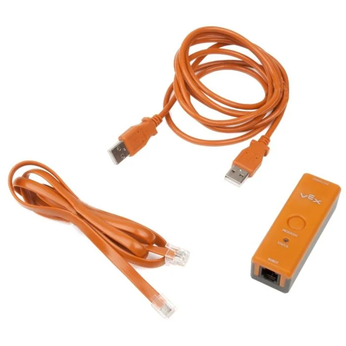

# 1.3 - Using the VEX Cortex

## 1.3.1 - Pairing VEXnet Joystick

Here are the steps to pair the VEX Cortex to the Joystick:

- Connect the battery to the Cortex.
- Install batteries into the Joystick.
- Connect the Joystick and the Cortex with the A-to-A USB cable.
- Turn the Cortex on, and wait for the VEXnet and Robot lights to turn green.
- Turn the Cortex off and remove USB cable from the Cortex and Joystick.
- Insert a VEXnet Key into the Cortex and Joystick.
- Turn on the Cortex and the Joystick.
- After a few moments, the Robot and VEXnet lights should turn green. This indicates the devices have paired successfully.

## 1.3.2 - Using RobotC over VEXnet

To set up RobotC on the Cortex, you must first follow the firmware setup described in `1.2.3.2` (Method Two).

It is often preferable for the computer to be able to communicate with the VEX Cortex wirelessly. This allows for live debugging while the VEX Joystick is in use and allows for changes on the fly without taking the robot out of service.

Using RobotC over VEXnet requires the **programming hardware kit**, which is an optional part. Therefore, it is often not supplied by BEST Robotics. The team owns a programming hardware kit, but it is important to make sure it does not get mixed with returnable parts. The programming hardware kit consists of three bright orange parts: the programming module, USB A-to-A cable, and RJ12 6-pin cable. It is pictured below.

The USB A-A cable must be plugged into the computer and the programming module. The 6-pin cable must be plugged into the programming module and the program port of the VEX Joystick.

The Cortex must be turned on to establish the connection; however, the Joystick does not have to be powered on, as it receives power from the program cable.

When the Joystick is plugged in and the Cortex is on, the VEXnet connection should be established and RobotC may be used regularly.
