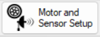
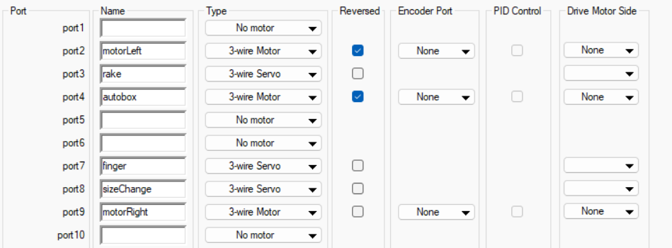

# 2.2 - Motor Setup

Setting up a motor is easy using the motor and sensor setup wizard.



The motor and sensor wizard defaults to opening to the motors tab.



To configure a motor, you must give it a *variable-compliant* name. **Do not use ports 1 and 10, as it is against BEST competition rules (and there should be no reason to use them.)**

The BEST Competition only uses two motor types: 3-wire motors (small and large motors) and 3-wire servos.

If a motor is spinning the wrong direction, it can be reversed without rewiring or changing motor values.

Here is an example of a motor command:

```C
// Motor values range from 127 to -127
motor[motorLeft] = 127;
```
[Up Next (2.3) ->](https://github.com/crcsrobotics/wiki/blob/main/2%20-%20ROBOTC/3%20-%20SENSORS.md)