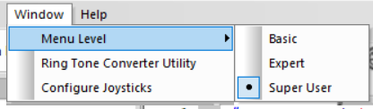

# 2.5 - Debugging in RobotC

RobotC can be used for robust debugging of issues with the robot.
To debug with RobotC while using the VEX Joystick, the computer must be connected wirelessly as described in section `1.3.2`.

To enable all debug menus, make sure the RobotC window menu level is set to "Super User".

To start the debug process, download the robot code to the robot and start the program. Under the "Robot" menu in the top bar, you can choose what debugger windows you wish to use.
Debugger windows are available for monitoring variables, joystick values, and debug stream output.

Text can be output using the `writeDebugStreamLine` command.
